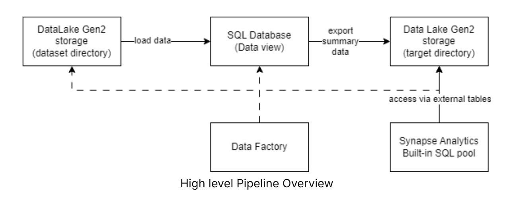
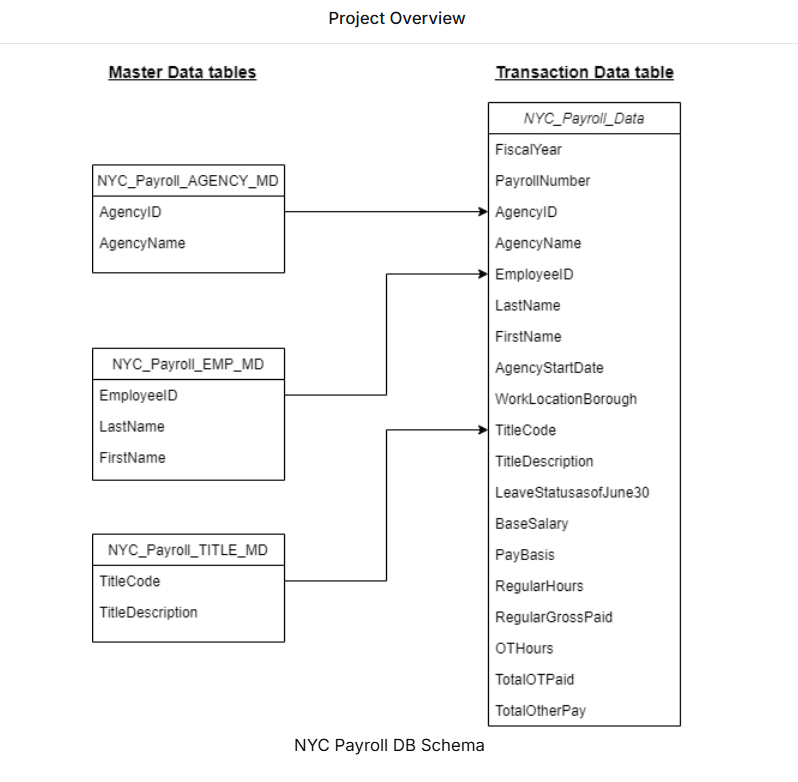

# Data Integration Pipelines for NYC Payroll Data Analytics

# Data Integration Pipelines for NYC Payroll Data Analytics

## Project Overview

This project builds an end-to-end data integration pipeline for the **NYC Payroll** dataset using Microsoft Azure services. The goal is to automate the ingestion, transformation, and analysis of payroll data so the City of New York can better understand salary and overtime spending and make this information available for public reporting.

The pipeline uses **Azure Data Factory** to ingest CSV files from **Azure Data Lake Storage Gen2**, load them into **Azure SQL Database**, generate summary data, and export the results back to the data lake. **Azure Synapse Analytics** then queries the processed data through external tables for analytics and reporting.

## High-Level Architecture



## Database Schema




## Technologies Used

- Azure Data Factory
- Azure Data Lake Storage Gen2
- Azure SQL Database
- Azure Synapse Analytics
- SQL

## Project Workflow

1. Ingest payroll CSV files from Azure Data Lake Storage Gen2.
2. Load and transform the data using Azure Data Factory.
3. Create views and aggregated payroll data in Azure SQL Database.
4. Export the processed data to Azure Data Lake Storage Gen2.
5. Query the exported data through Azure Synapse Analytics external tables.

## Repository Structure

```text
NYX-Payroll-Data_Analytics-Azure
├── architecture/
│   ├── High_Level_Pipeline_Overview.png
│   └── NYC_Payroll_DB_Schema.png
│
├── azure_data_factory/
│   ├── datasets/          # Dataset definitions
│   ├── dataflows/         # Mapping Data Flows
│   ├── linked_services/   # Linked service configurations
│   └── pipelines/         # ETL pipelines
│
├── azure_synapse/         # SQL scripts and Synapse objects
├── infrastructure/        # Infrastructure configuration
├── sample_data/           # NYC Payroll sample datasets
└── README.md
```

## Learning Outcomes

- Designed and implemented an end-to-end ETL pipeline on Azure.
- Automated data movement using Azure Data Factory.
- Integrated Azure SQL Database with Azure Synapse Analytics.
- Built a cloud-based data warehouse for payroll analytics.
